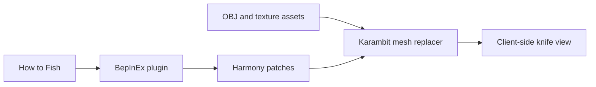

# How to Karambit

  
  

  
  
  
  
  

How to Karambit is a client-side cosmetic BepInEx mod for *How to Fish*. It replaces the held knife mesh with a configurable karambit without changing item damage, networking, animations, or save data.

## Features

- Blade Down and Blade Up grip poses.
- Support for the game's selected knife skin on the blade and ring.
- Optional original karambit material.
- Instant switch back to the default knife.
- In-game settings menu opened with `F10`.
- Settings persisted through BepInEx configuration.

## Installation

### Mod manager

Install the packaged mod through Thunderstore Mod Manager or r2modman, then launch the game through the selected profile.

### Manual

1. Install BepInEx 5 x64 for *How to Fish* and run the game once.
2. Copy the `HowToKarambit` plugin folder into `BepInEx/plugins/`.
3. Keep the DLL and its `assets` directory together.
4. Start the game.

## Controls

Press `F10` to open or close the menu. While it is open:

| Shortcut | Action |
| --- | --- |
| Ctrl + Right Arrow | Switch grip pose |
| Ctrl + Left Arrow | Switch between game skins and the model's original material |
| Ctrl + Down Arrow | Switch between the karambit and default knife |

Settings are saved to `BepInEx/config/com.keyerrorfinn.karambit.cfg`.

## Building from source

The project targets .NET Framework 4.7.2 and references assemblies from a local BepInEx profile and *How to Fish* installation.

1. Copy `GameReferences.props.example` to `GameReferences.props`.
2. Set its local game/BepInEx paths.
3. Build `Karambit.csproj` with the .NET SDK.

The optional `DeployToProfile` MSBuild property copies the built DLL, symbols, and assets into the configured profile after a successful build.

## Compatibility

The packaged release targets *How to Fish* 1.0.10 with BepInEx 5.4.x. It is cosmetic and client-side; other players only see it if they install the mod.

## Project flow

